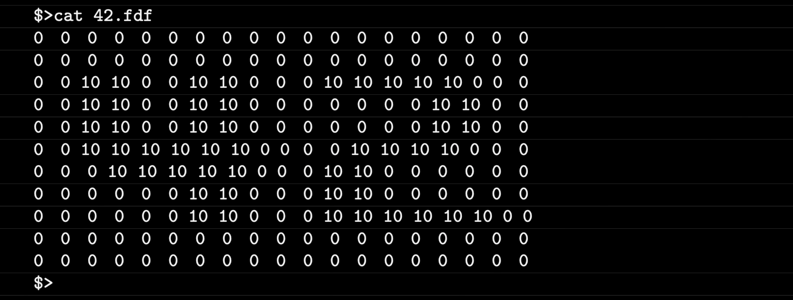

# fdf

FDF is short for ’fil de fer’ in French which means ’wireframe
model’.

## Summary:
This project is about representing a landscape as a 3D object
in which all surfaces are outlined in lines.

## Introduction
The representation in 3D of a landscape is a critical aspect of modern mapping. For
example, in these times of spatial exploration, to have a 3D representation of Mars is a
prerequisite condition to its conquest.
As another example, comparing various 3D representations of an area of high tectonic
activity will allow you to better understand these phenomena and their evolution, and as
a result, be better prepared.
It’s your turn today to modelize some 3D magnificent landscapes, imaginary or not.

## Objectives
It’s time for you to create a basic computer graphics project!
You are going to use the school graphical library: the MiniLibX! This library was
developed internally and includes basic necessary tools to open a window, create images
and deal with keyboard and mouse events.
This will be the opportunity for you to get familiar with the MiniLibX, to discover the
basics of graphics programming, especially how to place points in space, join them
and, most important, how to see the scene from a specific viewpoint.

## Rendering
Your program has to represent the model in isometric projection.
The coordinates of the landscape are stored in a .fdf file passed as a parameter to
your program. Here is an example:

https://github.com/tema-skakun/fdf/blob/214aefdc1b6bcbe4f7ccef914b3caf478b569012/Screenshot%202022-02-24%20at%2007.16.31.png
Screenshot 2022-02-24 at 07.16.31.png

Each number represents a point in space:
• The horizontal position corresponds to its axis.
• The vertical position corresponds to its ordinate.
• The value corresponds to its altitude.
Executing your fdf program using the example file 42.fdf:

Should render a landscape similar to:

[alt text]('Screenshot 2022-02-24 at 07.17.51.png' "42")

